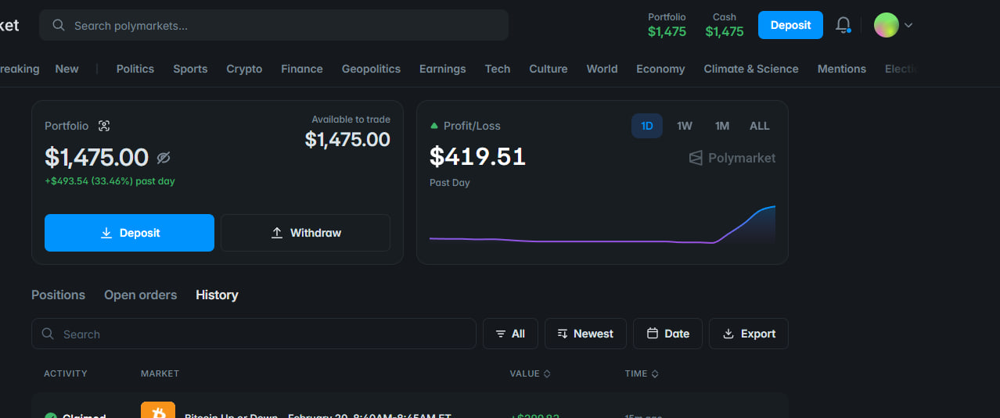
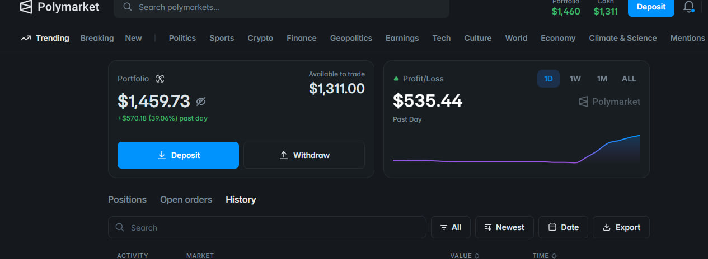
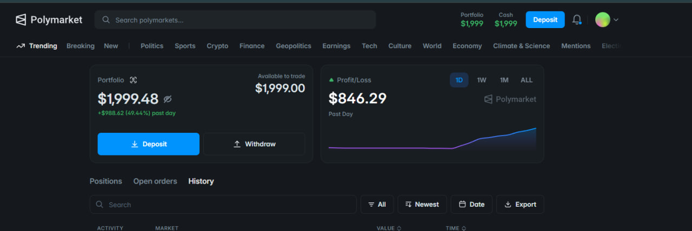
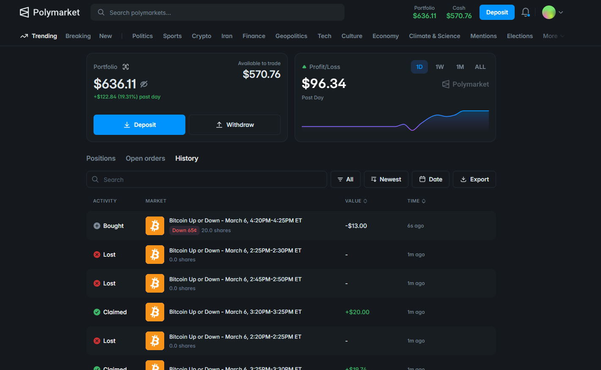
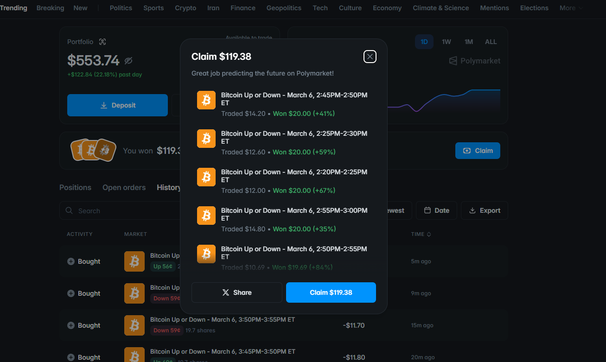

<h1 align="center">Polymarket Analyzer ⚡</h1>

<a href="README.md">English</a> · <a href="README.zh-CN.md">简体中文</a> · <b>Русский</b>

Репозиторий: <a href="https://github.com/0xsebasneuron/polymarket-arbitrage-copy-trading-bot-V2">0xsebasneuron/polymarket-arbitrage-copy-trading-bot-V2</a>

<h3>📅 Polymarket CLOB V2 и pUSD (данные из официальной документации)</h3>

Релиз <strong>CLOB V2</strong> Polymarket (<strong>28 апреля 2026</strong>) заменил матчинг и залог V1: торги приостанавливались примерно на <strong>час</strong> с ~<strong>11:00 UTC</strong>, все заявки V1 сняты с книги и должны быть выставлены заново по правилам V2. Новый залоговый токен — <strong>pUSD</strong> (Polymarket USD): ERC-20 с 6 знаками, в документации Polymarket указано обеспечение 1:1 USDC, контролируемое смарт-контрактом. Этот репозиторий — <strong>актуальная GUI-сборка</strong> автора под этот стек (<code>py-clob-client-v2</code> / <code>https://clob.polymarket.com</code>). Перед расширением approve/балансов сверяйтесь с актуальной <a href="https://docs.polymarket.com/resources/contracts">таблицей контрактов</a>.

Источники: <a href="https://help.polymarket.com/en/articles/14762452-polymarket-exchange-upgrade-april-28-2026">обновление биржи (Help Center)</a> · <a href="https://docs.polymarket.com/v2-migration">миграция CLOB V2</a> · <a href="https://docs.polymarket.com/concepts/pusd">pUSD</a> · <a href="https://docs.polymarket.com/resources/contracts">контракты</a>.

<table>
  <thead>
    <tr>
      <th>Пункт</th>
      <th>Значение (из публичных материалов Polymarket / Polygon)</th>
    </tr>
  </thead>
  <tbody>
    <tr>
      <td>Сеть</td>
      <td>Polygon PoS, <code>chainId</code> <strong>137</strong> (все торговые контракты Polymarket на этой сети).</td>
    </tr>
    <tr>
      <td>Окно обновления</td>
      <td><strong>2026-04-28</strong>, старт ~<strong>11:00 UTC</strong> — пауза торгов ~<strong>1 час</strong>; книги V1 очищены.</td>
    </tr>
    <tr>
      <td>CLOB API (production)</td>
      <td><code>https://clob.polymarket.com</code> — продакшен-хост V2 по руководству по миграции.</td>
    </tr>
    <tr>
      <td>Python SDK</td>
      <td><strong><code>py-clob-client-v2</code></strong> (старый <code>py-clob-client</code> только для V1).</td>
    </tr>
    <tr>
      <td>Залог (V2)</td>
      <td><strong>pUSD</strong> — ERC-20, 6 decimals; в документации Polymarket — обеспечение 1:1 USDC on-chain.</td>
    </tr>
    <tr>
      <td>USDC.e (legacy)</td>
      <td><code>0x2791Bca1f2De4661ED88A30C99A7a9449Aa84174</code> — в примерах <code>CollateralOnramp.wrap()</code> как актив для wrap в pUSD. <a href="https://polygonscan.com/token/0x2791Bca1f2De4661ED88A30C99A7a9449Aa84174">Polygonscan</a></td>
    </tr>
    <tr>
      <td>Native USDC (Circle, Polygon)</td>
      <td><code>0x3c499c542cEF5E3811e1192ce70d8cC03d5c3359</code> — нативный USDC Circle на Polygon PoS (эталон для «native USDC» в экосистеме). <a href="https://polygonscan.com/token/0x3c499c542cEF5E3811e1192ce70d8cC03d5c3359">Polygonscan</a></td>
    </tr>
    <tr>
      <td>Токен pUSD (proxy)</td>
      <td><code>0xC011a7E12a19f7B1f670d46F03B03f3342E82DFB</code> — в списке контрактов Polymarket: «pUSD — CollateralToken (proxy)». <a href="https://polygonscan.com/address/0xC011a7E12a19f7B1f670d46F03B03f3342E82DFB">Polygonscan</a></td>
    </tr>
    <tr>
      <td>CollateralOnramp</td>
      <td><code>0x93070a847efEf7F70739046A929D47a521F5B8ee</code> — wrap USDC.e → pUSD в официальных примерах. <a href="https://polygonscan.com/address/0x93070a847efEf7F70739046A929D47a521F5B8ee">Polygonscan</a></td>
    </tr>
    <tr>
      <td>CTF Exchange V2 (стандарт)</td>
      <td><code>0xE111180000d2663C0091e4f400237545B87B996B</code> — EIP-712 <code>verifyingContract</code> для обычных рынков (версия домена <code>&quot;2&quot;</code>). <a href="https://polygonscan.com/address/0xE111180000d2663C0091e4f400237545B87B996B">Polygonscan</a></td>
    </tr>
    <tr>
      <td>Neg-risk CTF Exchange V2</td>
      <td><code>0xe2222d279d744050d28e00520010520000310F59</code> — отдельный <code>verifyingContract</code> для neg-risk. <a href="https://polygonscan.com/address/0xe2222d279d744050d28e00520010520000310F59">Polygonscan</a></td>
    </tr>
    <tr>
      <td>CTF Exchange V1 (устарел)</td>
      <td><code>0x4bFb41d5B3570DeFd03C39a9A4D8dE6Bd8B8982E</code> — в миграции только для сравнения; не использовать в новых интеграциях.</td>
    </tr>
  </tbody>
</table>

<em>Адреса могут меняться при ротации реализаций — ориентируйтесь на <a href="https://docs.polymarket.com/resources/contracts">docs.polymarket.com/resources/contracts</a> при обновлении <code>PM_RPC_URL</code>, целей allowance и ABI.</em>

<h2>🧭 О проекте</h2>
<ul>
  <li><strong>Сначала GUI:</strong> многие решения под Polymarket заточены под TUI; этот клиент — для тех, кто хочет полноценный рабочий стол: обе стороны стакана, графики и исполнение в одном окне PyQt.</li>
  <li><strong>Хостинг ближе к площадке:</strong> для чувствительной к задержке работы с CLOB используйте VPS в <strong>Ирландии</strong> или рядом, в регионе, где Polymarket доступен и юридически допустим для вас. RTT до API и релееров напрямую влияет на исполнение.</li>
  <li><strong>Ядро в духе арбитража:</strong> интерфейс связан с межногой логикой, откалиброванной примерно на <strong>30 днях</strong> архивных 5-минутных серий BTC up/down (только исследовательский датасет; рынки меняются, прошлое не гарантия).</li>
</ul>

<strong>Автор:</strong> вопросы, нестабильная кривая PnL или настройка — Telegram: <a href="https://t.me/sebasneuron">@sebasneuron</a>. Часто причина в хостинге, сдвиге времени или конфигурации стакана; по логам это обычно быстро сужается.

Высокопроизводительный настольный клиент на Python и интерфейс командной строки для количественного анализа, визуализации в реальном времени и исполнения заявок на <strong>централизованной книге заявок (CLOB) Polymarket</strong>.

Набор ориентирован на бинарные рынки «вверх/вниз» (например, <code>btc-updown-5m-*</code>): разрешение активных рынков через Gamma API, двусторонняя потоковая передача по WebSocket для состояния стакана и встроенная среда для одноногих заявок CLOB с симуляцией и журналированием сессий.

<blockquote>
  
<strong>⚠️ Отказ от ответственности:</strong> это инструмент для разработчиков и исследования рынка, а не инвестиционная рекомендация. Торговля на рынках прогнозов связана с существенным риском потери капитала.

</blockquote>

<h2 align="center">📸 Скриншоты</h2>

Веб-интерфейс Polymarket (справочно): портфель, дневной P/L, история по рынкам <em>Bitcoin Up or Down</em> и сценарий получения выигрыша — схожие рынки с теми, что анализирует этот клиент.

  
  &nbsp;
  
  &nbsp;
  

  
  &nbsp;
  

<h2>🛠 Архитектура и возможности</h2>

<ul>
  <li><strong>Асинхронный двусторонний стриминг:</strong> <code>websockets</code> и <code>qasync</code> для неблокирующих обновлений обеих сторон стакана в цикле событий PyQt.</li>
  <li><strong>Спред в реальном времени:</strong> расчёт и отображение динамического спреда (<code>mid</code> / <code>1 - mid</code>) с помощью <code>pyqtgraph</code>.</li>
  <li><strong>Конвейер исполнения:</strong> симуляция и реальная торговля через <code>py-clob-client-v2</code>; маршрутизация одобрений через прокси и поддержка мультиподписи.</li>
  <li><strong>Безопасное хранение секретов:</strong> локальное хранилище SQLite (<code>db/polymarket_analyzer.sqlite</code>), чтобы снизить риск утечки приватных ключей из <code>.env</code>.</li>
</ul>

<h2>📦 Установка</h2>

<strong>Требования:</strong> Python <strong>3.10+</strong> (рекомендуется <strong>3.11</strong>). Установите Python для своей ОС, клонируйте репозиторий и поставьте зависимости через <code>pip</code>. Проверка: <code>python --version</code> (в Windows ещё <code>py --version</code>; в Linux часто <code>python3 --version</code>).

<h3>1. Установка Python (по ОС)</h3>

<h4>Windows 10 / 11</h4>

<strong>winget</strong>:

<pre><code class="language-powershell">winget install -e --id Python.Python.3.11
</code></pre>

<strong>Chocolatey</strong> (если установлен): <code>choco install python311 -y</code>. Перезапустите терминал, затем <code>python --version</code> или <code>py -3.11 --version</code>.

<h4>macOS</h4>

<strong>Homebrew</strong>:

<pre><code class="language-bash">brew install python@3.11
echo 'export PATH="/opt/homebrew/opt/python@3.11/bin:$PATH"' &gt;&gt; ~/.zshrc   # Apple Silicon; на Intel часто /usr/local/opt/...
source ~/.zshrc
python3.11 --version
</code></pre>

<h4>Linux — Debian / Ubuntu</h4>
<pre><code class="language-bash">sudo apt update
sudo apt install -y python3.11 python3-pip
python3.11 --version
</code></pre>

Если пакета <code>python3.11</code> нет: <code>sudo apt install -y python3 python3-pip</code> (достаточно 3.10+).

<h4>Linux — Fedora</h4>
<pre><code class="language-bash">sudo dnf install -y python3.11
python3.11 --version
</code></pre>

<h4>Linux — Arch</h4>
<pre><code class="language-bash">sudo pacman -S --needed python python-pip
python --version
</code></pre>

<h3>2. Клонирование репозитория</h3>
<pre><code class="language-bash">git clone https://github.com/0xsebasneuron/polymarket-arbitrage-copy-trading-bot-V2.git
cd polymarket-arbitrage-copy-trading-bot-V2
</code></pre>

<strong>Опционально:</strong> виртуальное окружение (<code>python -m venv .venv</code>) — если нужно изолировать пакеты от системного интерпретатора.

<h3>3. Зависимости проекта</h3>
<pre><code class="language-bash">python -m pip install --upgrade pip
python -m pip install -r requirements.txt
</code></pre>

В Linux при необходимости замените <code>python</code> на <code>python3</code>.

<h3>Установка и запуск одним шагом</h3>

В корне репозитория скрипты выполняют три шага: при необходимости ставят Python (<strong>Windows:</strong> <code>winget install Python.Python.3.11</code>, если нет <code>py</code>/<code>python</code> и есть winget, затем обновление PATH в этой же сессии; <strong>macOS:</strong> <code>brew install</code>, если через Homebrew; <strong>Debian/Ubuntu:</strong> <code>sudo apt-get install</code> для <code>python3</code> и pip); обновляют <code>pip</code> и ставят <code>requirements.txt</code>; затем <code>python -m polymarket_analyzer.qt_main</code> (на Windows часто через <code>py -3</code>). Если автоустановка не сработала, поставьте Python вручную и повторите:

<ul>
  <li><strong>Windows (двойной щелчок):</strong> <code>install-and-run.bat</code></li>
  <li><strong>Windows (PowerShell):</strong> <code>.\install-and-run.ps1</code> — при блокировке: <code>powershell -ExecutionPolicy Bypass -File .\install-and-run.ps1</code></li>
  <li><strong>macOS / Linux:</strong> один раз <code>chmod +x install-and-run.sh</code>, затем <code>./install-and-run.sh</code> — аргументы CLI: <code>./install-and-run.sh --symbol sol --interval 5</code></li>
</ul>

<h3>4. Конфигурация и запуск</h3>

Создайте файл <code>.env</code> в корне репозитория (рядом с <code>requirements.txt</code>) с минимум <code>PM_RPC_URL</code> и ключами из раздела <em>Переменные окружения</em> ниже. Затем из корня репозитория запустите GUI:

<pre><code class="language-bash"># Основной способ: отдельная точка входа GUI (по умолчанию btc, 5 мин)
python -m polymarket_analyzer.qt_main

# Опционально: символ и интервал в минутах (1–60)
python -m polymarket_analyzer.qt_main --symbol eth --interval 15

# NDJSON-поток без GUI (пример)
python -m polymarket_analyzer --symbol btc --interval 5
</code></pre>

Дополнительные флаги — в разделе <strong>Использование</strong> ниже.

<h2>🚀 Использование</h2>

<h3>Графический интерфейс (PyQt6)</h3>

Запуск визуального анализатора. <code>qasync</code> связывает цикл <code>asyncio</code> с Qt, чтобы интерфейс оставался отзывчивым при частых обновлениях WebSocket.

<pre><code class="language-bash"># Рекомендуемая команда (как в шаге 4)
python -m polymarket_analyzer.qt_main

# Явно указать актив и интервал (минуты)
python -m polymarket_analyzer.qt_main --symbol btc --interval 5

# Альтернатива: тот же GUI через основной пакет
python -m polymarket_analyzer --gui
</code></pre>

<h3>CLI без GUI (NDJSON)</h3>

Удобно для передачи данных стакана в другие сервисы или БД: структурированный NDJSON в <code>stdout</code>.

<pre><code class="language-bash"># Поток данных по 5-минутному рынку BTC
python -m polymarket_analyzer --symbol btc --interval 5

# Дополнительные параметры
python -m polymarket_analyzer --symbol eth --interval 15 --duration 60 -q
</code></pre>
<ul>
  <li><code>--duration &lt;seconds&gt;</code>: завершить поток через заданное число секунд.</li>
  <li><code>-q</code>: тихий режим (меньше служебных логов).</li>
</ul>

<h3>Локальное хранилище секретов (SQLite)</h3>

Вместо только текстового <code>.env</code> можно использовать встроенное хранилище SQLite для чувствительных параметров.

<pre><code class="language-bash"># Путь к базе
python -m polymarket_analyzer --sqlite-path

# Сохранить приватный ключ в локальной БД
python -m polymarket_analyzer --sqlite-save pm_private_key "0xYourPrivateKeyHere"
</code></pre>

<h2>⚙️ Переменные окружения</h2>

При старте <code>python-dotenv</code> загружает переменные из текущего рабочего каталога.

<table>
  <thead>
    <tr>
      <th>Переменная</th>
      <th>Тип</th>
      <th>Назначение</th>
    </tr>
  </thead>
  <tbody>
    <tr>
      <td><code>PM_PRIVATE_KEY</code></td>
      <td><code>Hex-строка</code></td>
      <td>Приватный ключ для подписи CLOB. <em>(Псевдонимы: <code>POLYMARKET_PRIVATE_KEY</code>, <code>PRIVATE_KEY</code>)</em></td>
    </tr>
    <tr>
      <td><code>PM_SIG_TYPE</code></td>
      <td><code>Целое</code></td>
      <td><code>0</code> = EOA (напрямую)   <code>1</code> = POLY_PROXY   <code>2</code> = Gnosis Safe</td>
    </tr>
    <tr>
      <td><code>PM_FUNDER</code></td>
      <td><code>Адрес</code></td>
      <td>Необязательно. Явный адрес финансирующей стороны / хранилища для проверок маржи.</td>
    </tr>
    <tr>
      <td><code>PM_RPC_URL</code></td>
      <td><code>URL</code></td>
      <td>JSON-RPC Polygon для кошелька и проверки allowance.</td>
    </tr>
    <tr>
      <td><code>PM_SIMULATE</code></td>
      <td><code>Логический</code></td>
      <td>Если истина (<code>1</code>, <code>true</code> и т.д.), заявки не отправляются через <code>post_order</code>, а только логируются локально.</td>
    </tr>
    <tr>
      <td><code>PM_BUILDER_KEY</code></td>
      <td><code>Строка</code></td>
      <td>Ключ Builder API (нужен для одобрений релеера при типах подписи 1 / 2).</td>
    </tr>
    <tr>
      <td><code>PM_BUILDER_SECRET</code></td>
      <td><code>Строка</code></td>
      <td>Секрет Builder API.</td>
    </tr>
    <tr>
      <td><code>PM_BUILDER_PASSPHRASE</code></td>
      <td><code>Строка</code></td>
      <td>Парольная фраза Builder API.</td>
    </tr>
  </tbody>
</table>

<blockquote>
  
<strong>Безопасность:</strong> не коммитьте реальный <code>.env</code> и файл <code>db/polymarket_analyzer.sqlite</code>; убедитесь, что они указаны в <code>.gitignore</code>.

</blockquote>

<h2>📂 Структура кода</h2>

Репозиторий разделён на UI, ядро исполнения и взаимодействие с сетью.

<pre><code>polymarket_analyzer/
├── __init__.py        # Экспорт пакета и ленивая загрузка GUI
├── __main__.py        # CLI: GUI, NDJSON-поток, настройка SQLite
├── qt_main.py         # Точка входа приложения PyQt
├── core/              # Модели, Gamma, стакан, WebSocket-сессии
├── trading/           # Математика спреда, исполнитель CLOB, стратегии
├── infra/             # Конфигурация окружения и SQLite
├── chain/             # Web3 (балансы, запросы к Polygon RPC)
└── ui/                # Окна PyQt, pyqtgraph, асинхронные задачи
</code></pre>

<h2>📄 Лицензия</h2>

<em>Файл лицензии не приложен; все права защищены. Не распространяйте и не используйте в продакшене без явного разрешения.</em>

